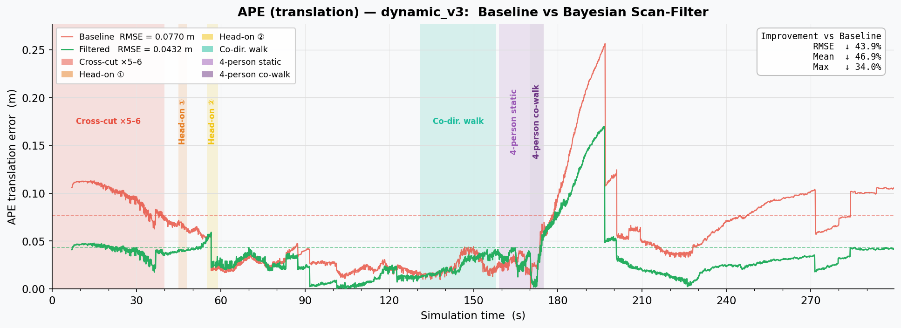
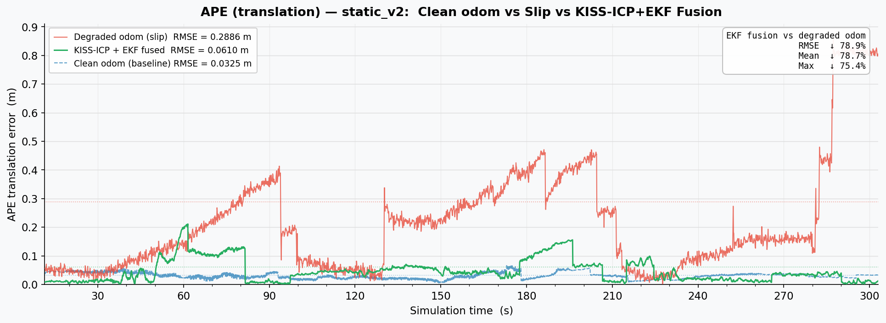
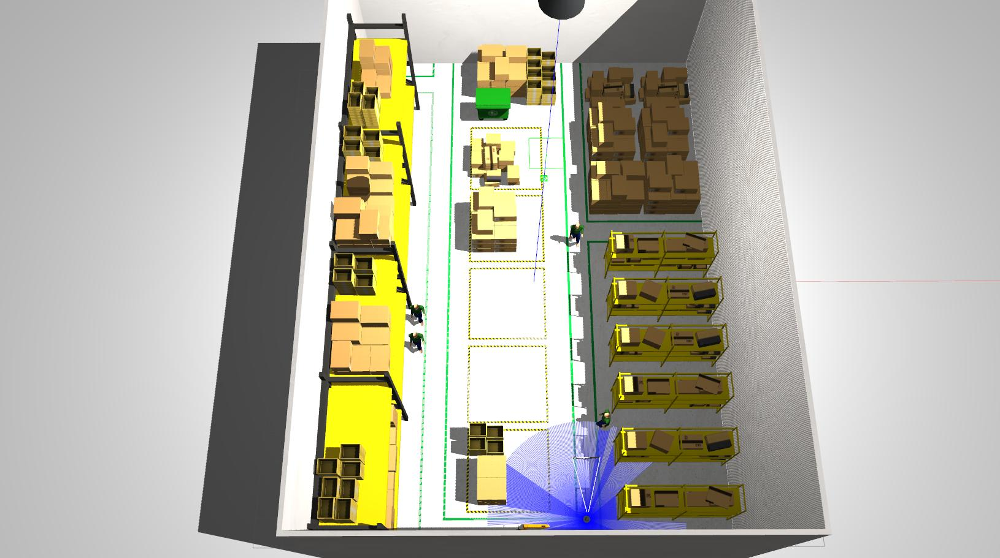

# Robust-Carto-SLAM (ROS 2 · Gazebo)

Cartographer localization hardened against two real-world failure modes: wheel-slip odometry degradation and dynamic obstacles (pedestrians).

Two independent hardening modules, each targeting a distinct Cartographer failure mode in real warehouse deployments.

**RMSE ↓78.9%** under wheel slip (KISS-ICP + EKF fusion) &nbsp;|&nbsp; **RMSE ↓43.9%** under pedestrian traffic (Bayesian scan filter) &nbsp;·&nbsp; ROS 2 Humble · Gazebo Classic

> **TL;DR** — A ROS 2 localization stack that stays accurate even when:
> - 🛞 **wheels slip** and odometry drifts (EKF fuses wheel encoder + LiDAR ICP + IMU)
> - 🚶 **people walk around** the robot (Bayesian filter removes dynamic beams before scan matching)
>
> Both modules plug into stock Cartographer with no changes to the core SLAM algorithm.

---

## ⭐ Highlights

- **Real-time Bayesian scan filter** — C++ ROS 2 node; per-beam `P(dynamic)` updated online, with motion guard and reference-freeze logic. Drops 2–5 % of beams in crowded scenes, near-zero overhead otherwise.
- **Custom Gazebo plugin** — `gazebo_actor_proxy_follower` makes scripted walking actors physically solid (rigid-body collision proxy tracks the actor skeleton), enabling realistic LiDAR occlusion in simulation.
- **Multi-sensor EKF fusion** — wheel encoder + KISS-ICP (LiDAR) + IMU fused via `robot_localization`; each sensor assigned a non-overlapping state-space role to avoid double-integration artefacts.
- **Structured dynamic benchmark** — 4-phase pedestrian stress test with ground truth from Gazebo model states; fully reproducible via rosbag2 offline replay.
- **End-to-end evaluation pipeline** — `evo_ape` + custom time-series plots with event annotations; results traceable to committed bag metadata.

---

## 🎬 Demo

**Synchronized view — ROS map + trajectory · Gazebo scene**




> APE over time: raw Cartographer (red) vs Bayesian-filtered scan (green).
> The spike at t≈195 s (**0.256 m** baseline) reflects a delayed loop-closure correction
> triggered ~20 s after the 4-person blockade ends — entirely suppressed by the filter.



> APE over time: degraded wheel odometry (red) vs KISS-ICP + EKF fused (green) vs clean odom baseline (blue dashed).

---

## 📊 Results

### Experiment 1 — Slip-robust odometry fusion (static_v2)

| Scenario | RMSE | Mean | Median | Max |
|---|---:|---:|---:|---:|
| Clean odometry (baseline) | 0.033 m | 0.031 m | 0.029 m | 0.069 m |
| Degraded wheel odom (slip) | 0.289 m | 0.218 m | 0.166 m | 0.859 m |
| **KISS-ICP + EKF fused** | **0.061 m** | **0.047 m** | **0.037 m** | **0.211 m** |
| Improvement vs slip | **↓78.9%** | **↓78.7%** | **↓77.7%** | **↓75.4%** |

### Experiment 2 — Bayesian dynamic scan filter (dynamic_v3)

| Scenario | RMSE | Mean | Median | Max |
|---|---:|---:|---:|---:|
| Static baseline | 0.022 m | 0.020 m | 0.019 m | 0.066 m |
| Dynamic, raw scan | 0.077 m | 0.063 m | 0.055 m | 0.256 m |
| **Dynamic + Bayesian filter** | **0.043 m** | **0.033 m** | **0.029 m** | **0.169 m** |
| Improvement | **↓43.9%** | **↓46.8%** | **↓46.8%** | **↓33.9%** |

Filter params: `eps_d = 0.10 m` · `α = 0.95` · `β = 0.60` · `dyn_threshold = 0.68`

---

## 💡 Key Insights

### Module 1 — EKF odometry fusion (slip)

> **TF consistency is a hard requirement.**

> **EKF tuning: divide and conquer.** Fusing two odometry streams naively caused the noisy wheel pose to corrupt the KISS-ICP estimate. The working configuration assigns each source a strictly separate role:
> - **Wheel odom (noisy)** → velocity only (`vx`, `ω_z`) — provides short-term motion continuity
> - **KISS-ICP** → pose only (`x`, `y`, `yaw`) — provides long-range drift correction
> - **IMU** → `ω_z` only — no absolute yaw (compass unavailable in 2D)
>
> Also: KISS-ICP runs at the lidar rate (**5 Hz** on TB3 LDS), so `sensor_timeout` must be set to ≥ 0.5 s or the EKF stalls between updates.

### Module 2 — Bayesian scan filter (dynamic obstacles)

> **Why does the filter suppress the t≈195 s spike?**
> Cartographer's loop-closure optimizer runs asynchronously. When 4 persons block the robot's field of view for ~16 s, raw scans accumulate corrupted matches. The optimizer detects the inconsistency and issues a large pose correction ~20 s after the blockade ends — visible as the **0.256 m** spike. The Bayesian filter removes the corrupted beams at source, so the optimizer never sees the false matches and the correction never fires.

> **Filtering is not free.** With `eps_d = 0.40 m` (too coarse) the filter produces **0 % beam removal** and performs identically to the raw baseline. The three parameters `eps_d / α / β` must be calibrated for the specific sensor-environment pair. With `eps_d = 0.10 m` the filter removes **2–5 %** of beams in dynamic segments — the target operating range.

---

## 🧪 Experiment Design

The dynamic_v3 bag encodes a structured 4-phase pedestrian stress test in simulation time:

| Phase | Sim Time | Scenario | Challenge |
|---|---|---|---|
| Cross-cut | 0–40 s | 1 person, lateral passes ×5–6 | Repeated short occlusions |
| Head-on | 45–59 s | 1 person approaching from front | Range decrease towards robot |
| Co-dir. walk | 131–158 s | 1 person walks 5 m ahead of robot | Sustained foreground clutter |
| 4-person blockade | 159–175 s | 4 persons static, then co-walking | Maximum scan corruption |

Between episodes, persons are teleported to `z = −10 m` to avoid physical collision with the robot while resetting to the next start position.

Ground truth is recorded from Gazebo's internal model state (`/eval/ground_truth/pose`). The bag starts at sim time t = 7 s; APE is computed with `evo_ape --align --correct_scale`.

---

## 🏗️ System Overview

| Stage | Component |
|---|---|
| **Mapping** | Cartographer offline SLAM → `.pbstream` |
| **Localization** | Cartographer pure-localization mode |
| **Slip fix** | KISS-ICP + robot_localization EKF → `/odometry/filtered` fed to Cartographer |
| **Dynamic filter** | `scan_filter_node` (Bayesian per-beam P(dynamic), 3 key params) inserted between `/scan` and Cartographer |
| **Evaluation** | `evo_ape`, ground truth from Gazebo `/eval/ground_truth/pose` |

🔌 **Future:** camera topic recorded alongside lidar — enables ML-based dynamic segmentation as a drop-in filter replacement.

### Repository layout

```
ros2_ws/src/
  dynamic_carto_demo/           launch files, configs, helper nodes
  scan_filter/                  Bayesian dynamic-obstacle scan filter (C++)
  gazebo_actor_proxy_follower/  Gazebo plugin: makes scripted actors physically solid
scripts/
  plot_ape_comparison.py        dynamic_v3 APE comparison plot
  plot_ape_static_v2.py         static_v2 APE comparison plot
docs/assets/                    tracked media (plots, GIF) referenced by README
experiments/                    experiment index and reproducible command templates
```

---

## 🚀 Quick Start

### Prerequisites

- ROS 2 Humble, Gazebo Classic 11
- `cartographer_ros`, `robot_localization`, `kiss_icp_ros`
- [AWS RoboMaker Small Warehouse World](https://github.com/aws-robotics/aws-robomaker-small-warehouse-world) models (for simulation)

### Build

```bash
cd ros2_ws && colcon build && source install/setup.bash
```

<details>
<summary>📦 Step 1 — Simulation &amp; bag recording</summary>



```bash
source /opt/ros/humble/setup.bash
source ros2_ws/install/setup.bash

# Static world (Experiment 1 — slip)
ros2 launch dynamic_carto_demo tb3_warehouse.launch.py

# Dynamic world with walking people (Experiment 2 — dynamic obstacles)
ros2 launch dynamic_carto_demo tb3_warehouse.launch.py \
  use_actor_people:=true \
  aws_warehouse_models:=<path/to/aws-robomaker-small-warehouse-world/models>
```

In a separate terminal, record the bag while driving the robot:

```bash
ros2 bag record -o bags/my_bag \
  /scan /odom /odom_noisy /imu /tf /tf_static /clock \
  /eval/ground_truth/pose /eval/ground_truth/odom
```

</details>

<details>
<summary>🗺️ Step 2 — Offline mapping</summary>

```bash
export DATA_ROOT="$(pwd)/data"

ros2 launch dynamic_carto_demo offline_mapping.launch.py \
  bag:="$DATA_ROOT/bags/my_bag" \
  pbstream_out:="$DATA_ROOT/maps/my_map.pbstream"

# Optional: export the map to PNG/PGM for inspection
ros2 run cartographer_ros cartographer_pbstream_to_ros_map \
  -pbstream_filename="$DATA_ROOT/maps/my_map.pbstream" \
  -map_filestem="$DATA_ROOT/maps/my_map" \
  -resolution=0.05
```

</details>

<details>
<summary>🤖 Step 3 — Localization experiments</summary>

All runs write a bag containing `/tracked_pose` and `/eval/ground_truth/pose`.

**Experiment 1 — Slip robustness (static bag)**

```bash
export DATA_ROOT="$(pwd)/data"

# 1a) Baseline: clean wheel odometry
ros2 launch dynamic_carto_demo offline_localization.launch.py \
  bag:="$DATA_ROOT/bags/my_bag" \
  pbstream_in:="$DATA_ROOT/maps/my_map.pbstream" \
  bag_out:="$DATA_ROOT/bags/loc_odom" \
  odom_topic:=/odom use_sim_time:=true

# 1b) Degraded: noisy/slipping wheel odometry
ros2 launch dynamic_carto_demo offline_localization.launch.py \
  bag:="$DATA_ROOT/bags/my_bag" \
  pbstream_in:="$DATA_ROOT/maps/my_map.pbstream" \
  bag_out:="$DATA_ROOT/bags/loc_noisy" \
  odom_topic:=/odom_noisy use_sim_time:=true

# 1c) Fused: KISS-ICP + EKF odometry fed to Cartographer
ros2 launch dynamic_carto_demo offline_localization_fused.launch.py \
  bag:="$DATA_ROOT/bags/my_bag" \
  pbstream_in:="$DATA_ROOT/maps/my_map.pbstream" \
  bag_out:="$DATA_ROOT/bags/loc_fused" \
  use_sim_time:=true
```

**Experiment 2 — Dynamic obstacle filtering (dynamic bag, reuses map from Exp 1)**

```bash
export DATA_ROOT="$(pwd)/data"

# 2a) Baseline: raw scan, no filter
ros2 launch dynamic_carto_demo offline_localization.launch.py \
  bag:="$DATA_ROOT/bags/my_dynamic_bag" \
  pbstream_in:="$DATA_ROOT/maps/my_map.pbstream" \
  bag_out:="$DATA_ROOT/bags/loc_dynamic_raw" \
  use_sim_time:=true

# 2b) Filtered: Bayesian scan filter removes dynamic-obstacle beams
ros2 launch dynamic_carto_demo offline_localization_filtered.launch.py \
  bag:="$DATA_ROOT/bags/my_dynamic_bag" \
  pbstream_in:="$DATA_ROOT/maps/my_map.pbstream" \
  bag_out:="$DATA_ROOT/bags/loc_dynamic_filtered" \
  use_sim_time:=true
```

</details>

<details>
<summary>📈 Step 4 — Evaluation</summary>

**Install evo** (one-time):

```bash
python3 -m venv ~/evo_venv && source ~/evo_venv/bin/activate
pip install "evo" "matplotlib>=3.7,<3.10" numpy
export MPLBACKEND=Agg QT_QPA_PLATFORM=offscreen
```

**Export poses to TUM format:**

```bash
source ros2_ws/install/setup.bash

ros2 run dynamic_carto_demo bag_pose_to_tum \
  "$DATA_ROOT/bags/loc_fused" /eval/ground_truth/pose -o "$DATA_ROOT/eval/gt.tum"
ros2 run dynamic_carto_demo bag_pose_to_tum \
  "$DATA_ROOT/bags/loc_fused" /tracked_pose           -o "$DATA_ROOT/eval/tracked.tum"
```

**Compute APE:**

```bash
source ~/evo_venv/bin/activate

evo_ape tum "$DATA_ROOT/eval/gt.tum" "$DATA_ROOT/eval/tracked.tum" \
  --align --correct_scale --t_max_diff 0.05 \
  --save_results "$DATA_ROOT/eval/ape.zip" --save_plot "$DATA_ROOT/eval/ape.pdf"
```

**Reproduce the figures in this README:**

```bash
python3 scripts/plot_ape_static_v2.py    # Experiment 1 — slip
python3 scripts/plot_ape_comparison.py   # Experiment 2 — dynamic filtering
```

</details>

---

## License

MIT
